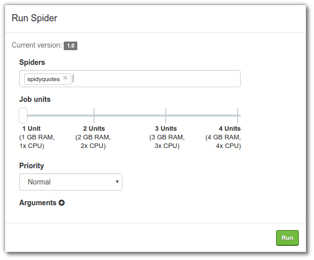
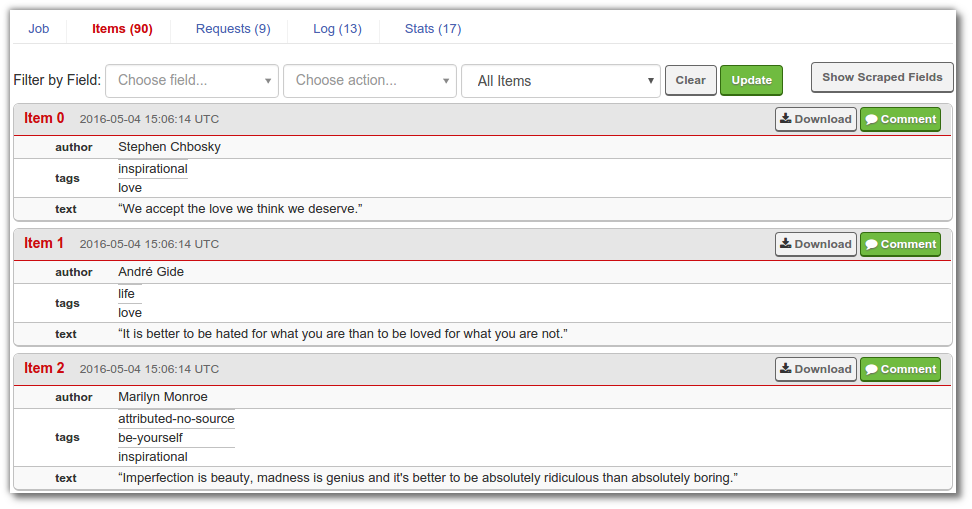

============
Scrapy Cloud
============

*Scrapy Cloud* is a Scrapinghub service to deploy and run `Scrapy`_ spiders and
:ref:`custom python scripts <sc-scripts>`.

Pricing
=======

Scrapy Cloud pricing is based on the number of Container Units that you
purchase. Each Unit provides 1GB of RAM, 2.5GB of storage, a given amount of
CPU capacity and 1 concurrent crawl. You can purchase as many units as you need
and allocate them to your spiders.

One Container Unit is given **for free** once you subscribe to Scrapy Cloud,
and you can use it for as long as you want. Free subscriptions have a data
retention period of 7 days and one single job can not run for more than 24
hours.

Once you purchase your first unit, your subscription is upgraded. In addition
to a Container Unit replacing your previously free one, you'll have these
benefits:

- 120 days of data retention.
- No limitation on job running time.
- Ability to deploy custom Docker Images to Scrapy Cloud.

Check the `Scrapinghub Pricing`_ page for more details.

Creating a Scrapy Spider
========================

Let's start by creating our Scrapy spider. If you already have a Scrapy
project, you can skip this section.

This assumes you have Scrapy already installed, otherwise please refer to the
`Scrapy installation guide`_.

For this example, we will build a spider to scrape famous quotes from this
website: http://quotes.toscrape.com/

We begin by creating a Scrapy project which we will call ``quotes_crawler``::

    $ scrapy startproject quotes_crawler

Then we create a spider for ``quotes.toscrape.com``::

    $ scrapy genspider quotes-toscrape quotes.toscrape.com
    Created spider 'quotes-toscrape' using template 'basic' in module:
    quotes_crawler.spiders.quotes_toscrape

Then we edit the spider::

    $ scrapy edit quotes-toscrape

Here is the code:

.. literalinclude:: _static/sc-quotes-toscrape.py

For more information about Scrapy please refer to the `Scrapy documentation`_.

.. _deploy:

Deploying a Scrapy Spider
=========================

.. note::
    You will need the :ref:`Scrapinghub command line client <shub>` to deploy
    projects to Scrapy Cloud, so install it if you have not done so yet. If
    you already have it installed, make sure you have the latest version:

    .. code:: bash

        $ pip install shub --upgrade

The next step is to deploy your Scrapy project to Scrapy Cloud. You will need
your API key and the numeric ID of your Scrapy Cloud project. You can find both
of these on your project's *Code & Deploys* page. First, run::

    $ shub login

to save your API key to a local file (``~/.scrapinghub.yml``). You can delete
it from there anytime via ``shub logout``. Next, run::

    $ shub deploy

to be guided through a wizard that will set up the project configuration file
(``scrapinghub.yml``) for you. After the wizard, your project will be uploaded
to Scrapy Cloud. You can re-trigger deployment (without having to go through
the wizard again) anytime via another call to ``shub deploy``.

Now you can schedule your spider to run on Scrapy Cloud::

    $ shub schedule quotes-toscrape
    Spider quotes-toscrape scheduled, job ID: 99830/1/1
    Watch the log on the command line:
        shub log -f 1/1
    or print items as they are being scraped:
        shub items -f 1/1
    or watch it running in Scrapinghub's web interface:
        https://app.scrapinghub.com/p/99830/job/1/1

And watch it run (replace ``1/1`` with the job ID ``shub`` gave you on the
previous command, you can leave out the project ID)::

    shub log -f 1/1

Alternatively, you can go to your project page and schedule the spider there:

|

Once the job has finished, or while it's running, you can click on the job to
review the scraped data and other information about the job:

Dependencies and External Libraries
===================================

The Scrapy Cloud platform comes with some libraries pre-installed that you can
use in your code without uploading an egg. `This support article
<https://support.scrapinghub.com/topic/205467-supported-libraries-on-scrapy-cloud/>`_
describes exactly which library versions are available, and you can also
subscribe to get notified of changes to such libraries.

If your project needs code from an external Python library, you can define
these dependencies in a requirements.txt file and set this file in your
project's ``scrapinghub.yml``, like this:

.. code::

    projects:
        default: 123
    requirements_file: requirements.txt

If you want to provide your own library for your project you can
:ref:`build a custom Docker image <custom-docker-image>` containing it **or**
you can proceed as follows:

#. Write your code.
#. Add a ``setup.py`` file in the base package folder, e.g.::

    from setuptools import setup, find_packages

    setup(
        name         = 'myproject',
        version      = '1.0',
        packages     = find_packages(),
        entry_points = {'scrapy': ['settings = myproject.settings']},
    )
   
   Note that ``entry_points`` line is essential because it points Scrapy Cloud to 
   default project settings.

#. Run ``shub deploy-egg PROJECTID`` to deploy to your project. (Note that you
   need to add the project ID since you usually are no longer within the Scrapy
   project's directory tree.)

See `setuptools`_ for details about egg concepts, preparation and building.

.. important:: You'll need to redeploy your project after new addons are added or removed.

.. _custom-docker-image:

Deploying Custom Docker Images
==============================
Scrapy Cloud runs your spiders in Docker containers. Paying customers can
create custom Docker images having whatever dependencies they need and
deploy these images to Scrapy Cloud using
`shub-image <https://github.com/scrapinghub/shub-image/>`_.

Check out this `walkthrough <https://shub-image.readthedocs.io/en/latest/>`_
on how to deploy custom images to Scrapy Cloud.

Using Stacks
============
Scrapy Cloud provides **Stacks**, a set of pre-built Docker images that you can
use to deploy your spiders to. For now, you can select between two stacks:

- `Hworker <https://github.com/scrapinghub/scrapinghub-stack-hworker>`_: this
  is the stack that's going to be used if you just run a regular
  ``shub deploy``.

- `Scrapy <https://github.com/scrapinghub/scrapinghub-stack-scrapy>`__: this is
  a minimalistic stack featuring the latest stable versions of Scrapy and of
  all the basic requirements you need to to run a full-featured Scrapy Spider.
  You might choose this Stack if you're having issues with outdated packages in
  your projects. Additional requirements can be included into a
  requirements.txt defined as the ``requirements_file`` property of your
  configuration file.

This is a scrapinghub.yml file example, using the Scrapy 1.1 stack and passing 
additional requirements to be installed on it via requirements.txt (please
make sure you're using `shub` 2.1.1+):

.. code::

    projects:
      default: 123
    stacks:
      default: scrapy:1.1
    requirements_file: requirements.txt

.. _sc-scripts:

Running custom python scripts
=============================

You can also run custom python scripts (ie. non Scrapy spiders) on Scrapy
Cloud. They need to be declared in the ``scripts`` section of your project
``setup.py`` file.

.. note:: Keep in mind that the project deployed needs to be a Scrapy project. This is a limitation for now, which will be removed in the future.

Here is a ``setup.py`` example for a project that ships a ``hello.py`` script::

    from setuptools import setup, find_packages

    setup(
        name         = 'myproject',
        version      = '1.0',
        packages     = find_packages(),
        scripts      = ['bin/hello.py'],
        entry_points = {'scrapy': ['settings = myproject.settings']},
    )

After you :ref:`deploy <deploy>` your project, you will see the ``hello.py``
script right below the list of spiders, in the schedule box (on Scrapinghub
dashboard).

You can also setup periodic jobs to run the script or do it via the API.

For running the script through the API, you need to use a private API (which may subject to change in the future). Here is an example using ``curl``::

    curl -u API_KEY: -X POST -d '{"job_cmd": ["py:hello.py"]}' https://storage.scrapinghub.com/jobq/PROJECT_ID/push

.. _Scrapy: http://scrapy.org
.. _Scrapy installation guide: http://doc.scrapy.org/en/latest/intro/install.html
.. _Scrapy documentation: http://doc.scrapy.org/
.. _setuptools: http://peak.telecommunity.com/DevCenter/setuptools
.. _Scrapinghub Pricing: http://scrapinghub.com/pricing/
